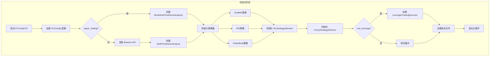
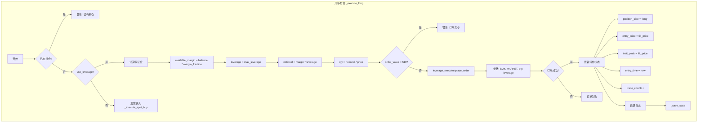
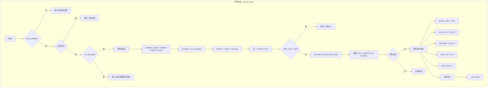
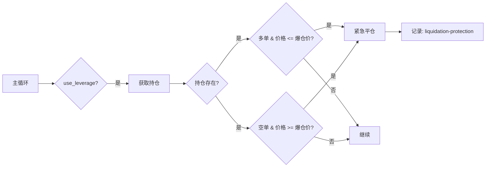
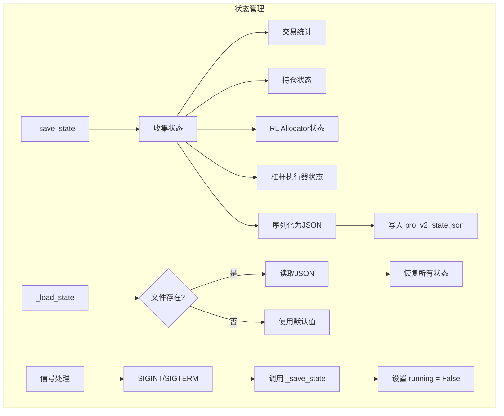
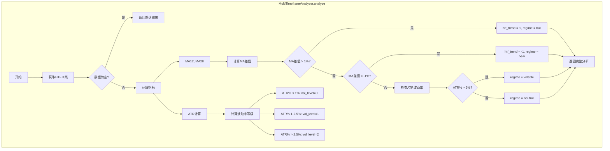

# Live Trading Pro V2 详细流程图

本文档展示 `live_trading_pro_v2.py` 机构级多策略杠杆交易系统的完整流程架构。

---

## 一、系统整体架构



---

## 二、主交易循环流程

```mermaid
flowchart TB
    subgraph MainLoop [主交易循环 run()]
        start[开始循环] --> get_price[获取价格数据]

        get_price --> client_check{client is None?}
        client_check -->|是| mock_data[使用 Mock 数据]
        client_check -->|否| api_call[调用 Binance API]

        mock_data --> mtf_mock[mtf.analyze()]
        api_call --> mtf_real[mtf.analyze()]

        mtf_mock --> calc_equity[计算权益]
        mtf_real --> calc_equity

        calc_equity --> check_position{是否持仓?}

        %% 持仓分支
        check_position -->|是| check_exit[_check_exit 检查平仓条件]
        check_exit --> exit_reason{退出原因?}

        exit_reason -->|止损| close_sl[_close_position stop-loss]
        exit_reason -->|止盈| close_tp[_close_position take-profit]
        exit_reason -->|最大持仓时间| close_hold[_close_position max-hold]
        exit_reason -->|趋势反转| close_rev[_close_position trend-reversal]
        exit_reason -->|无| log_position[记录持仓状态]

        close_sl --> save_state1[_save_state]
        close_tp --> save_state1
        close_hold --> save_state1
        close_rev --> save_state1
        save_state1 --> sleep1[sleep 10s]
        sleep1 --> start

        log_position --> sleep1

        %% 无持仓分支
        check_position -->|否| gen_signal[_generate_consensus_signal 生成共识信号]
        gen_signal --> signal_check{信号方向?}

        signal_check -->|1 做多| check_trend_up{htf_trend >= 0?}
        signal_check -->|-1 做空| check_trend_down{htf_trend <= 0?}
        signal_check -->|0 无信号| sleep2[sleep 30s]

        check_trend_up -->|是| exec_long[_execute_long 开多]
        check_trend_up -->|否| wait_up[等待趋势对齐]
        check_trend_down -->|是| exec_short[_execute_short 开空]
        check_trend_down -->|否| wait_down[等待趋势对齐]

        exec_long --> hourly[每小时报告]
        exec_short --> hourly
        wait_up --> hourly
        wait_down --> hourly
        sleep2 --> hourly

        hourly --> sleep3[sleep 30s]
        sleep3 --> start
    end
```

---

## 三、信号生成与RL权重分配流程

```mermaid
flowchart TB
    subgraph SignalGen [信号生成 _generate_consensus_signal]
        A[开始] --> B[获取LTF K线数据]
        B --> C{数据为空?}
        C -->|是| D[返回 无信号]
        C -->|否| E[遍历所有策略]

        E --> F[DualMA.generate_signal]
        E --> G[RSI.generate_signal]
        E --> H[OrderBook.generate_signal]

        F --> I[收集信号和置信度]
        G --> I
        H --> I

        I --> J[FuzzyStrategySelector.select]
        J --> K[输入参数]

        subgraph FuzzyInput [模糊选择器输入]
            K --> K1[regime: 市场状态]
            K --> K2[vol_level: 波动率等级]
            K --> K3[trend_strength: 趋势强度]
            K --> K4[ob_bias: 订单簿偏向]
            K --> K5[ai_direction: AI方向]
            K --> K6[ai_confidence: AI置信度]
        end

        J --> L[RLStrategyAllocator 计算权重]

        subgraph RLCalc [RL权重计算]
            L --> L1[查询 Q-Table]
            L1 --> L2[应用 EXP3 算法]
            L2 --> L3[更新策略权重]
            L3 --> L4[返回: primary, weights, confidence]
        end

        L --> M[加权信号计算]
        M --> N[sum(signal * weight)]
        N --> O{weighted_signal > 0.3?}
        O -->|是| P[final_signal = 1]
        O -->|否| Q{weighted_signal < -0.3?}
        Q -->|是| R[final_signal = -1]
        Q -->|否| S[final_signal = 0]

        P --> T[返回结果]
        R --> T
        S --> T
        D --> T
    end
```

---

## 四、杠杆交易执行流程

### 4.1 开多流程 `_execute_long`



### 4.2 开空流程 `_execute_short`



### 4.3 平仓流程 `_close_position`

```mermaid
flowchart TB
    subgraph ClosePosition [平仓 _close_position]
        A[开始] --> B{有持仓?}
        B -->|否| C[返回]
        B -->|是| D{use_leverage?}

        D -->|是| E[获取持仓]
        E --> F{持仓存在?}
        F -->|否| G[警告: 无持仓可平]
        F -->|是| H[确定平仓方向]
        H --> H1[多单: SELL]
        H --> H2[空单: BUY]

        H1 --> I[leverage_executor.place_order]
        H2 --> I

        I --> J{订单成功?}
        J -->|是| K[计算盈亏]
        K --> K1[多单: (fill - entry) * qty]
        K --> K2[空单: (entry - fill) * qty]

        K --> L[更新统计]
        L --> L1[daily_pnl += pnl]
        L --> L2[total_pnl += pnl]
        L --> L3[win/loss_count++]

        L --> M[记录交易结果]
        M --> N[更新 RL Allocator]
        N --> O[重置持仓状态]
        O --> O1[position_side = None]
        O --> O2[entry_price = 0]
        O --> O3[trail_peak = 0]
        O --> P[_save_state]

        D -->|否| Q[现货卖出 _execute_spot_sell]
    end
```

---

## 五、风险控制机制

### 5.1 平仓检查 `_check_exit`

```mermaid
flowchart TB
    subgraph CheckExit [平仓检查 _check_exit]
        A[开始] --> B{有持仓?}
        B -->|否| C[返回 None]
        B -->|是| D[计算持仓时间]

        D --> E{position_side?}

        %% 多单逻辑
        E -->|long| F1[更新 trail_peak = max(peak, price)]
        F1 --> G1[计算动态止损]
        G1 --> H1[dynamic_sl = peak - ATR * multiplier]
        H1 --> I1[stop = max(dynamic_sl, entry * 0.975)]
        I1 --> J1[take_profit = entry * 1.07]

        J1 --> K1{price <= stop?}
        K1 -->|是| L1[返回 stop-loss]
        K1 -->|否| M1{price >= tp?}
        M1 -->|是| N1[返回 take-profit]
        M1 -->|否| O1{hold_time > 48h?}
        O1 -->|是| P1[返回 max-hold]
        O1 -->|否| Q1{htf_trend == -1?}
        Q1 -->|是| R1[返回 trend-reversal]
        Q1 -->|否| S1[返回 None]

        %% 空单逻辑
        E -->|short| F2[更新 trail_peak = min(peak, price)]
        F2 --> G2[计算动态止损]
        G2 --> H2[dynamic_sl = peak + ATR * multiplier]
        H2 --> I2[stop = min(dynamic_sl, entry * 1.025)]
        I2 --> J2[take_profit = entry * 0.93]

        J2 --> K2{price >= stop?}
        K2 -->|是| L2[返回 stop-loss]
        K2 -->|否| M2{price <= tp?}
        M2 -->|是| N2[返回 take-profit]
        M2 -->|否| O2{hold_time > 48h?}
        O2 -->|是| P2[返回 max-hold]
        O2 -->|否| Q2{htf_trend == 1?}
        Q2 -->|是| R2[返回 trend-reversal]
        Q2 -->|否| S2[返回 None]
    end
```

### 5.2 爆仓风险检查



---

## 六、策略信号生成细节

### 6.1 DualMA 策略

```mermaid
flowchart TB
    subgraph DualMA [DualMAStrategy.generate_signal]
        A[输入: df, price] --> B{数据足够?}
        B -->|否| C[返回 (0, 0.5)]
        B -->|是| D[计算 MA 短期/长期]
        D --> E[获取当前和前一个值]

        E --> F{金叉?}
        F -->|是| G[计算强度]
        G --> H[strength = |MA短-MA长|/MA长]
        H --> I[返回 (1, min(0.5+strength*50, 0.9))]

        F -->|否| J{死叉?}
        J -->|是| K[返回 (-1, 0.6)]
        J -->|否| L[返回 (0, 0.5)]
    end
```

### 6.2 RSI 策略

```mermaid
flowchart TB
    subgraph RSI [RSIStrategy.generate_signal]
        A[输入: df, price] --> B{数据足够?}
        B -->|否| C[返回 (0, 0.5)]
        B -->|是| D[计算 RSI]
        D --> E[RSI < 30?]
        E -->|是| F[超卖 - 做多信号]
        F --> G[confidence = min(0.9, (30-RSI)/20+0.5)]
        G --> H[返回 (1, confidence)]

        E -->|否| I[RSI > 70?]
        I -->|是| J[超买 - 做空信号]
        J --> K[confidence = min(0.9, (RSI-70)/20+0.5)]
        K --> L[返回 (-1, confidence)]
        I -->|否| M[返回 (0, 0.5)]
    end
```

### 6.3 OrderBook 策略

```mermaid
flowchart TB
    subgraph OB [OrderBookStrategy.generate_signal]
        A[输入: df, price] --> B[获取订单簿]
        B --> C{获取成功?}
        C -->|否| D[返回 (0, 0.5)]
        C -->|是| E[计算买卖盘价值]
        E --> F[bid_usd = sum(price*qty)]
        E --> G[ask_usd = sum(price*qty)]
        F --> H[imb = bid_usd / ask_usd]
        G --> H

        H --> I[添加到历史]
        I --> J[计算平均imbalance]

        J --> K{avg_imb > 1.5?}
        K -->|是| L[买盘占优 - 做多]
        L --> M[conf = min(0.9, (imb-1)/2)]
        M --> N[返回 (1, conf)]

        K -->|否| O{avg_imb < 0.67?}
        O -->|是| P[卖盘占优 - 做空]
        P --> Q[conf = min(0.9, (1/imb-1)/2)]
        Q --> R[返回 (-1, conf)]
        O -->|否| S[返回 (0, 0.5)]
    end
```

---

## 七、Mock 数据生成流程（模拟交易）

```mermaid
flowchart TB
    subgraph MockData [MockMultiTimeframeAnalyzer]
        A[初始化] --> B[设置起始价格: $68,500]
        B --> C[设置波动率: 1.5%]
        C --> D[设置随机趋势]

        D --> E[analyze() 被调用]
        E --> F[生成价格变动]
        F --> G[change_pct = trend_drift + 随机噪声]
        G --> H[price *= (1 + change_pct)]

        H --> I{每50个tick?}
        I -->|是| J[随机切换趋势]
        I -->|否| K[保持当前趋势]

        J --> L[计算ATR]
        K --> L
        L --> M[确定市场状态]

        M --> N{trend == 1} --> O[regime = bull]
        M --> P{trend == -1} --> Q[regime = bear]
        M --> R{trend == 0} --> S[regime = neutral/volatile]

        O --> T[返回分析结果]
        Q --> T
        S --> T
    end
```

---

## 八、状态持久化流程



---

## 九、多时间框架分析流程



---

## 十、配置参数说明

| 参数 | 默认值 | 说明 |
|------|--------|------|
| `paper_trading` | True | 强制模拟交易模式 |
| `use_leverage` | True | 启用杠杆交易 |
| `max_leverage` | 3.0 | 最大杠杆倍数（已从10倍改为3倍） |
| `margin_fraction` | 0.95 | 保证金使用比例 |
| `base_position_pct` | 0.40 | 基础仓位比例 |
| `stop_loss` | 0.025 | 止损比例 (2.5%) |
| `take_profit` | 0.07 | 止盈比例 (7%) |
| `max_hold_hours` | 48 | 最大持仓时间 |
| `short_enabled` | True | 允许做空 |

---

## 十一、关键设计决策

### 1. 安全设计
- **强制模拟交易**: `paper_trading` 默认为 `True`，需要显式设置 `--live` 才能实盘
- **杠杆限制**: 已从10倍降至3倍，降低爆仓风险
- **保证金比例**: 使用95%保证金而非100%，保留缓冲

### 2. 策略融合
- **多策略信号**: DualMA + RSI + OrderBook
- **RL权重分配**: 使用 EXP3 算法动态调整策略权重
- **模糊选择器**: 根据市场状态选择最优策略组合

### 3. 风险控制
- **动态止损**: 基于ATR的追踪止损
- **时间止损**: 48小时强制平仓
- **趋势反转检测**: HTF趋势变化时提前退出
- **爆仓保护**: 实时监控爆仓价格

### 4. 数据架构
- **Mock数据**: 支持无API连接的纯模拟交易
- **状态持久化**: 支持中断恢复
- **双模式支持**: 杠杆/现货自由切换
