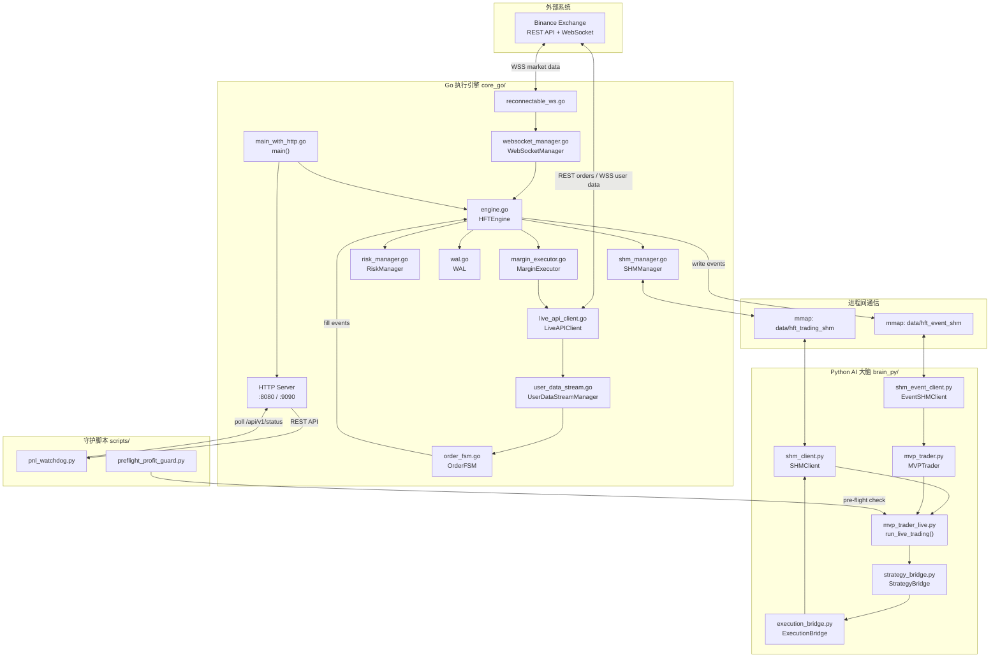
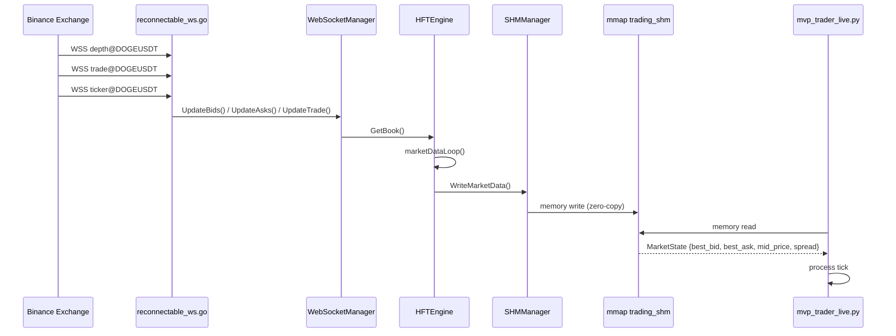
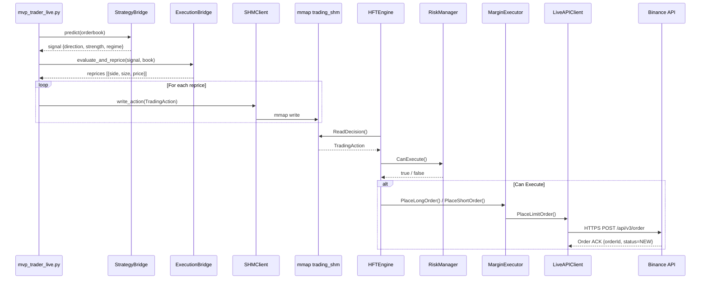
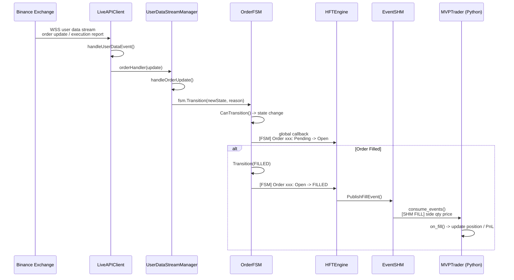
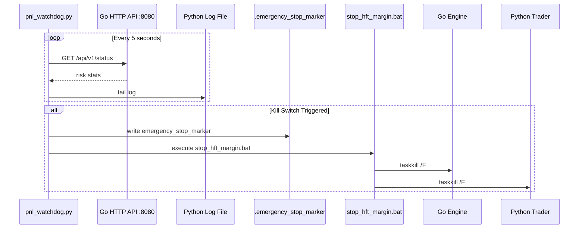
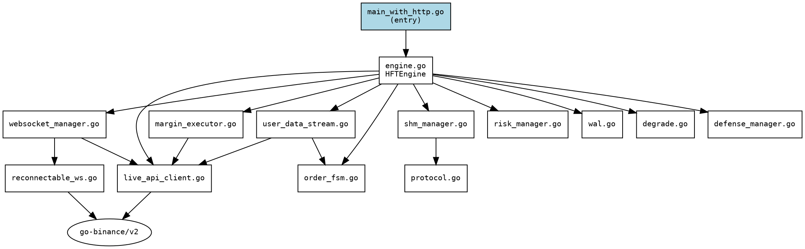
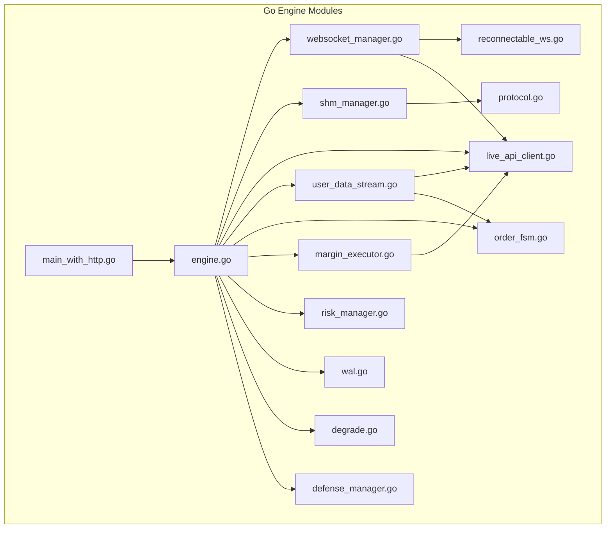
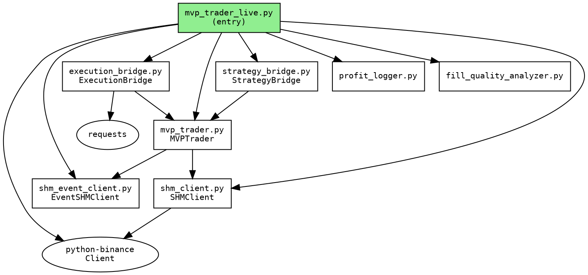
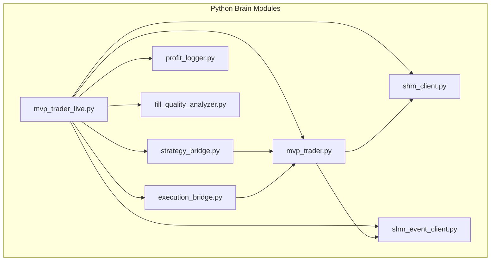
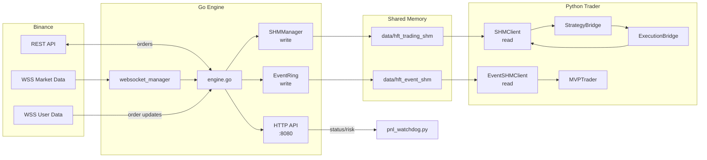

# 可视化架构图集 (Visual Architecture)

> 基于 AST 静态分析生成的 Mermaid + Graphviz 图表
> 生成时间: 2026-04-15

---

## 1. 系统架构概览 (Mermaid)



---

## 2. 市场数据流序列图



---

## 3. 交易决策与下单流序列图



---

## 4. 订单生命周期与 FSM 流序列图



---

## 5. 风控与熔断序列图



---

## 6. Go 模块依赖图 (Graphviz DOT)



### 渲染效果预览



---

## 7. Python 核心模块依赖图 (Graphviz DOT)



### 渲染效果预览



---

## 8. 完整端到端数据流图



---

## 使用说明

### 在 VS Code 中预览
安装 **Markdown Preview Mermaid Support** 插件，打开本文件即可直接渲染所有 Mermaid 图表。

### 在线渲染
- [Mermaid Live Editor](https://mermaid.live/)
- 复制上述代码块中的 Mermaid 语法即可实时渲染

### 将 Graphviz DOT 转换为图片
```bash
# 需要安装 graphviz
dot -Tpng go_deps.dot -o go_deps.png
dot -Tpng python_deps.dot -o python_deps.png
```

---

*本文档与 `CORE_SYSTEM_REFERENCE.md` 配套使用，前者提供图表化快速理解，后者提供精确的接口定义和函数级调用链。*
