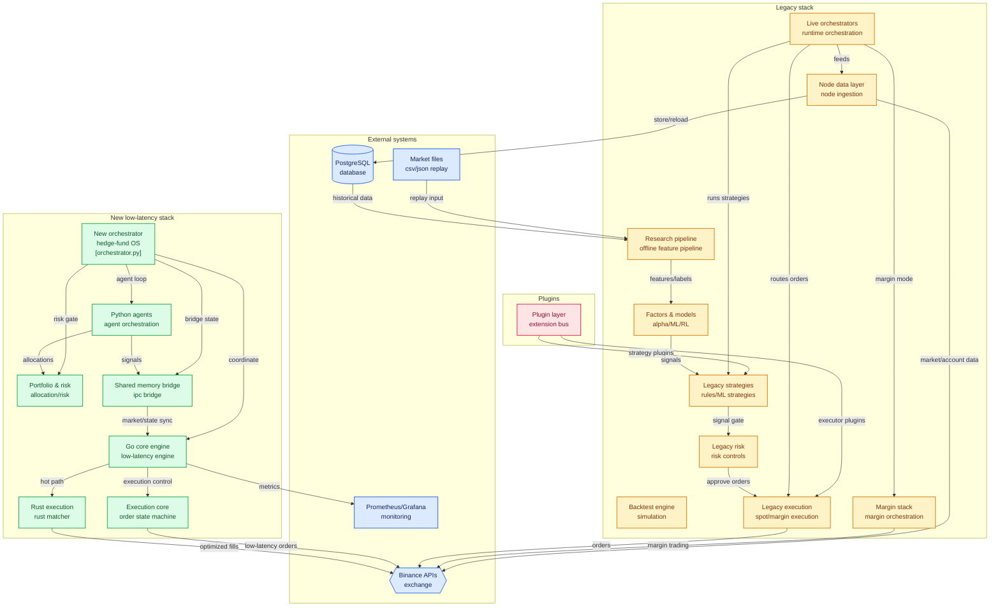

# HFT Trading System Architecture Diagram (Fixed)

## Mermaid Code (与图片完全一致)

## 布局说明

与原始 Mermaid 代码的主要区别：

1. **布局方向**: 改为从上到下（Top-Down），与图片一致
2. **子图顺序**: 
   - 顶部: Plugins
   - 左上: Legacy stack
   - 右上: New low-latency stack
   - 底部: External systems
3. **节点位置**: 按照图片中的相对位置重新排列
4. **连接线**: 调整连接方向以匹配视觉流向
